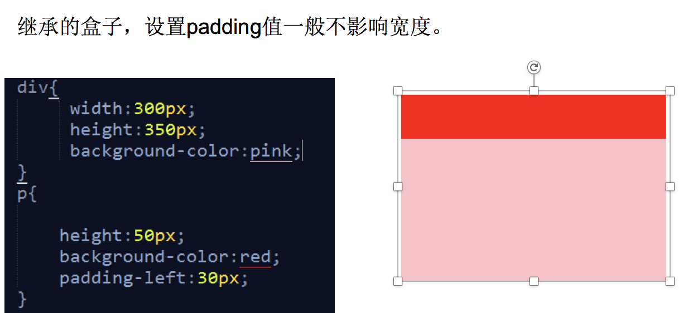

一：padding值一般不影响宽度		
		
二：box-sizing
border-box:padding和border被包含在定义的width和height之内
content-box：padding和border不被包含在定义的width和height之内。				

三：盒子宽度包括margin   
css中盒子模型由三部分组成: 1边框（border） 2 内边距（padding） 3外边距（margin）		
四：		
1：display:none        元素隐藏不占位置
    
2：overflow:hidden;  将超出部分的元素隐藏

3：visibility:hidden;    元素隐藏占位置

4.margin-left:auto     让盒子左侧充满
 margin-right:auto    让盒子右侧充满		
 
5.图片和文字垂直对齐		
使用 vertical-align:middle  让行内，行内块元素设置垂直距离

6.利用 padding-top特性， padding-top 50% ：高度 = 50% * 父宽度，		
五.对比		
宽度对比：		
		width:	content+padding+border+margin		
		offsetwidth:	width+padding+border		
		scrollWidth：内容宽度，可以非常大，不包括border		clientWidth:获取网页可视区域宽度,不包括卷去的，不包括border
		
		
left对比：		
offsetLeft：自己border最外边到 父盒子 border最里边距离(别忘了父盒子padding),数字，只读，可以没有定位		
style.left:必须有定位，可读写，带单位				
scrollleft  ||  pageXOffset:被卷去的部分		
clientLeft:就是border

X,Y对比：		
pageY:clientY+卷去高度
clientY:浏览器顶部距离
screenY:距离屏幕顶端距离
		
六.window.scrollTo 滚动到指定坐标
七：事件捕获：window-div 事件冒泡 div-window 往下传
八：对象：		

```
分为函数对象和普通对象
1、每一个函数对象都有一个prototype属性，但是普通对象是没有的；
　 prototype下面又有个construetor，指向这个函数。
2、每个对象都有一个名为_proto_的内部属性，指向它所对应的构造函数的原型对象，原型链基于_proto_;


第一种：Object创造
var Person = new Object();
Person.name = 'Nike';
Person.age = 29;

第二种：字面量
var o = {
            name : "zs",
            age : 18,
            sex : true,
            sayHi : function() {
                console.log(this.name);
            }
        };


第三种：构造方法
function person(first, last, age, eye) {
    this.firstName = first;
    this.lastName = last;
    this.age = age;
    this.eyeColor = eye;
}
第四种：原型

function Person(){}
Person.prototype.name = 'Nike';
Person.prototype.age = 20;
Person.prototype.jbo = 'teacher';
Person.prototype.sayName = function(){
 alert(this.name);
};

```
九：创建元素方式		

```
方式一：
document.write()
方式二：
innerHTML
方式三：
createElement()
appendChild()
removeChild()
insertBefore()
replaceChild()

```

十：jquery		

```
取
$(“#btnShow”) jquery对象

相互转换
DOM->JQ(我有钱[美元]，所以我的功能就更强大)
var t = document.getElementById("textDiv")
var $t = $(t)

JQ->DOM
$t.get(0)
```			


